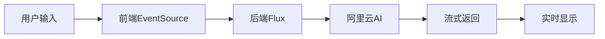
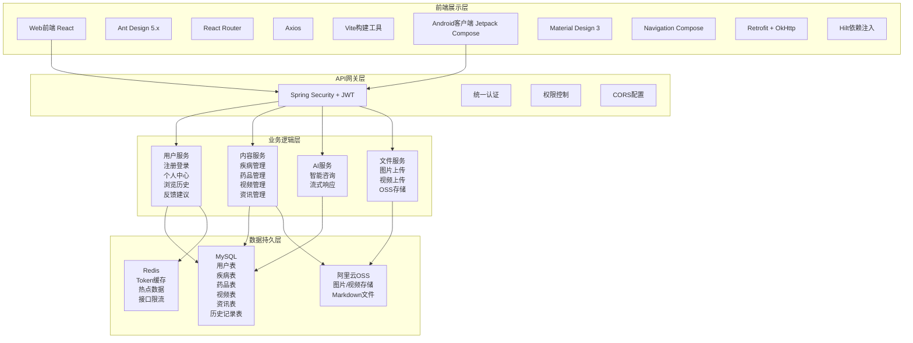
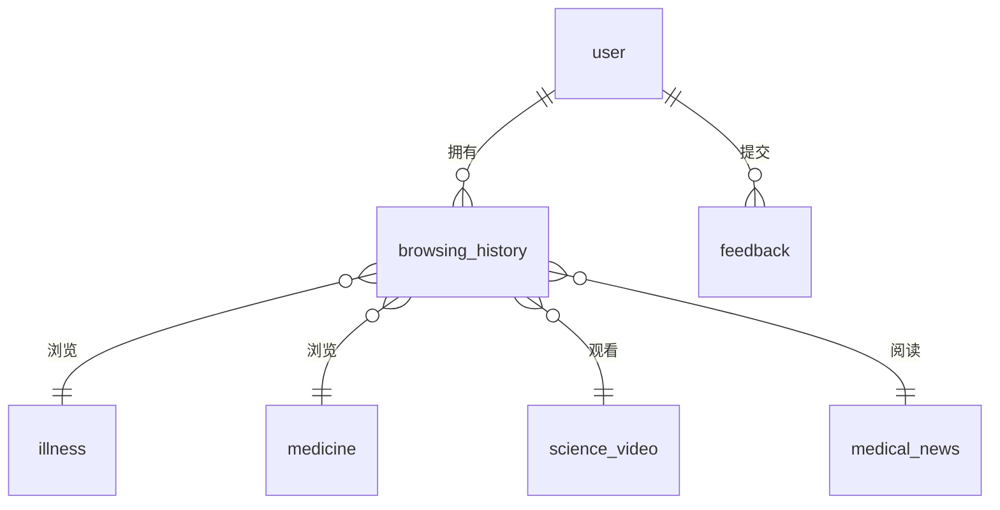
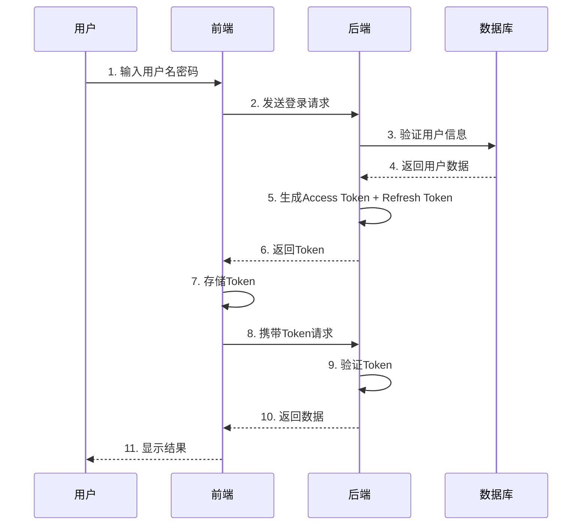
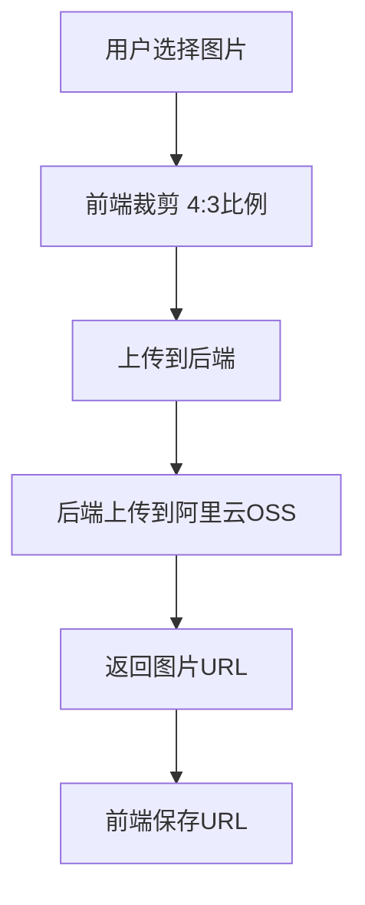
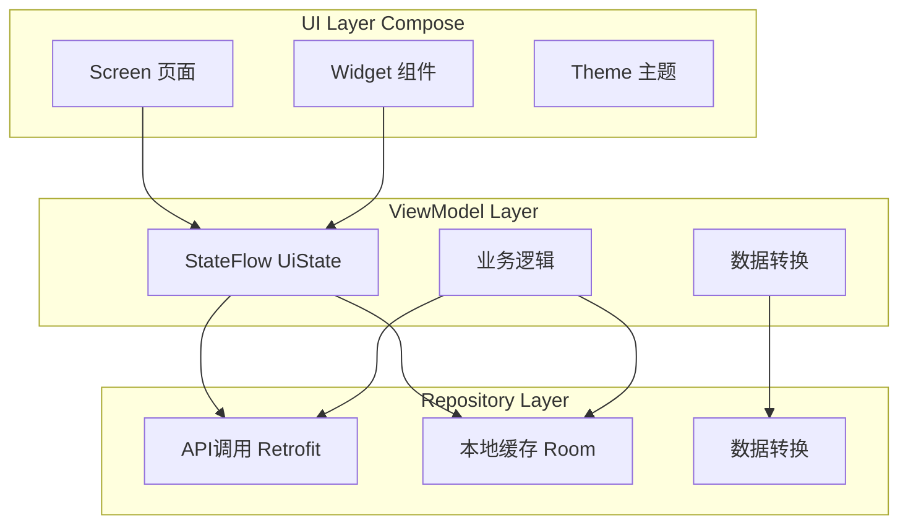

# 智慧医疗系统 - 毕业设计项目讲解
## 一、项目概述
### 1.1 项目背景与意义
随着互联网技术的快速发展和人们健康意识的不断提高，传统的医疗信息获取方式存在以下问题：

| 问题 | 描述 |
|------|------|
| 信息分散 | 医疗健康信息散布在各种网站和平台，用户难以快速获取 |
| 查询不便 | 缺乏统一的搜索入口，用户需要在不同平台间切换 |
| 专业门槛高 | 医学术语复杂，普通用户难以理解 |
| 咨询成本高 | 获取专业医疗咨询需要投入大量时间和金钱 |
| 信息质量参差 | 网络上的健康信息良莠不齐，缺乏权威性 |

智慧医疗系统旨在通过现代互联网技术，整合优质医疗资源，为用户提供便捷、专业、智能的健康信息服务。
### 1.2 项目简介
智慧医疗系统是一个全栈医疗健康管理平台，采用前后端分离架构设计，包含以下三个子系统：

| 子系统 | 说明 | 技术栈 |
|--------|------|--------|
| Web用户端 | 面向普通用户的健康信息服务平台 | React + TypeScript + Ant Design |
| Web管理后台 | 面向管理员的内容管理系统 | React + TypeScript + Ant Design |
| Android移动端 | 移动端健康应用 | Kotlin + Jetpack Compose |

### 1.3 开发环境
| 类别 | 工具/技术 | 版本 | 用途 |
|------|-----------|------|------|
| IDE | IntelliJ IDEA | 2024 | 后端开发 |
| IDE | Android Studio | Hedgehog (2023.1.1) | Android开发 |
| IDE | VS Code | Latest | 前端开发 |
| 语言 | Java | 17 | 后端开发 |
| 语言 | Kotlin | 1.9.22 | Android开发 |
| 语言 | TypeScript | 5.9.3 | 前端开发 |
| 数据库 | MySQL | 8.0+ | 关系数据库 |
| 缓存 | Redis | 6.0+ | 缓存数据库 |
| 构建工具 | Maven | 3.9+ | Java项目构建 |
| 构建工具 | Gradle | 8.5 | Android项目构建 |
| 构建工具 | Vite | 5.4.8 | 前端构建 |
---
## 二、系统功能详解
### 2.1 用户端功能模块
#### 2.1.1 首页模块
**功能描述：** 系统首页集中展示平台核心功能和推荐内容。

**核心功能列表：**

| 功能 | 描述 | 技术实现 |
|------|------|----------|
| 健康资讯轮播 | 左右叠层轮播效果，自动展示最新资讯 | CSS3动画 + React State |
| 搜索功能 | 统一搜索入口，支持疾病/药品/资讯搜索 | Ant Design Input + API |
| 标签切换 | 三大板块快速切换 | React Router + State |
| 推荐内容 | 热门疾病、常用药品、最新资讯 | 后端API推荐 |

**轮播效果参数：**

| 参数 | 值 | 说明 |
|------|-----|------|
| 切换间隔 | 5秒 | 自动播放时间 |
| 动画时长 | 600ms | 过渡动画时间 |
| 缓动函数 | FastOutSlowInEasing | 动画曲线 |
| 左侧偏移 | -110dp | 左侧卡片位移 |
| 右侧偏移 | +110dp | 右侧卡片位移 |
| 缩放比例 | 0.85 | 两侧卡片缩放 |
| 透明度 | 0.5 | 两侧卡片透明度 |

#### 2.1.2 疾病查询模块
**功能清单：**

| 功能 | 说明 |
|------|------|
| 分类浏览 | 按科室分类（内科、外科、妇产科、儿科等） |
| 关键词搜索 | 支持疾病名称、症状关键词搜索 |
| 疾病详情 | 症状、病因、治疗、预防等信息 |
| 相关药品 | 根据疾病推荐相关药品 |
| 浏览历史 | 自动记录浏览过的疾病 |

**疾病表结构：**

| 字段 | 类型 | 说明 |
|------|------|------|
| id | INT | 主键 |
| illness_name | VARCHAR(100) | 疾病名称 |
| category | VARCHAR(50) | 所属分类 |
| symptoms | TEXT | 症状描述 |
| causes | TEXT | 病因分析 |
| treatment | TEXT | 治疗方法 |
| prevention | TEXT | 预防措施 |
| img_path | VARCHAR(255) | 疾病图片 |
| view_count | INT | 浏览量 |
#### 2.1.3 药品查询模块
**功能清单：**

| 功能 | 说明 |
|------|------|
| 分类浏览 | 处方药、非处方药、中药、西药等 |
| 关键词搜索 | 药品名称、功效、适应症搜索 |
| 药品详情 | 功效、用法、禁忌、注意事项 |
| 按疾病查找 | 选择疾病查看相关药品 |
#### 2.1.4 AI智能咨询模块（亮点功能）
**功能特点：**

| 特点 | 实现 |
|------|------|
| 对话式界面 | 类似聊天的消息气泡展示 |
| 流式响应 | AI回复逐字显示，提升体验 |
| 多轮对话 | 支持上下文记忆 |
| 历史记录 | 查看和管理历史咨询 |

**技术实现架构：**

**核心代码：**
```java
@PostMapping("/stream")
public Flux<String> consultStream(@RequestParam String message) {
    Prompt prompt = new Prompt(new UserMessage(message));
    return aiChatStreamChatModel.stream(prompt)
        .map(response -> response.getResult().getOutput().getContent());
}
```
#### 2.1.5 健康资讯模块
**功能特色：**

| 功能 | 说明 |
|------|------|
| 资讯轮播 | 首页展示最新资讯 |
| Markdown渲染 | 支持富文本格式 |
| 封面裁剪 | 4:3比例图片裁剪上传 |
| 相关推荐 | 推荐相关资讯 |
#### 2.1.6 个人中心模块
**功能清单：**

| 功能 | 说明 |
|------|------|
| 个人资料 | 查看、编辑个人信息 |
| 头像上传 | 图片裁剪上传 |
| 修改密码 | 安全的密码修改流程 |
| 浏览历史 | 按类型查看浏览记录 |
| 反馈建议 | 向平台提交反馈 |
### 2.2 管理后台功能模块
**管理功能总览**

| 模块 | 功能 | 操作 |
|------|------|------|
| 数据看板 | 统计展示 | 用户数、内容数、反馈数统计 |
| 用户管理 | 用户管理 | 查看、删除用户 |
| 疾病管理 | 疾病CRUD | 新增、编辑、删除、上传图片 |
| 药品管理 | 药品CRUD | 新增、编辑、删除、上传图片 |
| 视频管理 | 视频CRUD | 上传视频、编辑信息、删除 |
| 资讯管理 | 资讯CRUD | Markdown编辑、发布/下架、删除 |
| 反馈管理 | 反馈处理 | 查看、删除反馈 |
### 2.3 Android移动端功能
**应用架构**

| 层级 | 技术 | 说明 |
|------|------|------|
| UI层 | Jetpack Compose | 声明式UI |
| ViewModel层 | ViewModel + StateFlow | 业务逻辑 |
| Repository层 | Repository模式 | 数据仓库 |
| 数据源 | API + Room数据库 | 网络 + 本地缓存 |

**核心功能**

| 功能 | 说明 |
|------|------|
| 首页 | 资讯轮播、搜索、标签切换、推荐内容 |
| 详情页 | 疾病、药品、视频、资讯详情展示 |
| AI咨询 | 对话界面、流式响应、历史记录 |
| 个人中心 | 资料编辑、浏览历史、退出登录 |
---
## 三、系统设计详解
### 3.1 整体架构设计
**系统架构图**

### 3.2 技术栈详解
#### 后端技术栈
| 技术 | 版本 | 用途 |
|------|------|------|
| Spring Boot | 3.5.6 | 基础框架 |
| Spring Security | - | 安全认证 |
| Spring AI | 1.0.0.2 | AI集成 |
| MyBatis Plus | 3.5.12 | ORM框架 |
| MySQL Driver | 8.0+ | 数据库驱动 |
| Redis | 6.0+ | 缓存客户端 |
| Knife4j | 4.6.0 | API文档 |
| Hutool | 5.8.27 | 工具库 |
| Lombok | 1.18.32 | 简化代码 |
#### 前端技术栈
| 技术 | 版本 | 用途 |
|------|------|------|
| React | 18.3.1 | UI框架 |
| TypeScript | 5.9.3 | 类型系统 |
| Vite | 5.4.8 | 构建工具 |
| Ant Design | 5.18.4 | UI组件库 |
| React Router | 6.26.2 | 路由管理 |
| Axios | 1.7.7 | HTTP客户端 |
| React Markdown | 10.1.0 | Markdown渲染 |
| Day.js | 1.11.13 | 日期处理 |
#### Android技术栈
| 技术 | 版本 | 用途 |
|------|------|------|
| Kotlin | 1.9.22 | 开发语言 |
| Jetpack Compose | - | UI框架 |
| Hilt | - | 依赖注入 |
| Room | 2.6.1 | 本地数据库 |
| Retrofit | 2.9.0 | 网络请求 |
| OkHttp | 4.12.0 | HTTP客户端 |
| Coil | - | 图片加载 |
| DataStore | - | 数据持久化 |
| Navigation Compose | - | 路由导航 |

### 3.3 数据库设计
**核心数据表**
| 表名 | 说明 | 主要字段 |
|------|------|----------|
| user | 用户表 | id, username, password, nickname, avatar, email, phone |
| illness | 疾病表 | id, illness_name, category, symptoms, causes, treatment, img_path |
| medicine | 药品表 | id, medicine_name, medicine_type, efficacy, usage_dosage, contraindications |
| science_video | 视频表 | id, title, description, video_url, cover_url, category |
| medical_news | 资讯表 | id, news_name, news_summary, cover_oss_path, markdown_oss_path, status |
| browsing_history | 浏览历史 | id, user_id, operate_type, operate_id, operate_name |
| feedback | 用户反馈 | id, user_id, content, contact, status |

**数据库关系**

---
## 四、核心功能实现详解
### 4.1 AI智能咨询（亮点功能）
#### 4.1.1 技术选型
| 选型 | 说明 |
|------|------|
| 大模型 | 阿里云通义千问 |
| 集成框架 | Spring AI 1.0.0.2 |
| 传输方式 | SSE (Server-Sent Events) |
| 响应方式 | 流式返回 |
#### 4.1.2 后端实现
```java
@Service
public class AiChatService {
    private final ChatModel aiChatStreamChatModel;
    /**
     * 流式AI咨询
     */
    public Flux<String> consultStream(String message) {
        Prompt prompt = new Prompt(
            new SystemMessage("你是一个专业的医疗健康咨询助手..."),
            new UserMessage(message)
        );
        return aiChatStreamChatModel.stream(prompt)
            .map(chatResponse -> {
                String content = chatResponse.getResult()
                    .getOutput().getContent();
                return content != null ? content : "";
            })
            .filter(content -> !content.isEmpty());
    }
}
```
#### 4.1.3 前端实现
```typescript
// EventSource连接
const streamResponse = async (message: string) => {
  const eventSource = new EventSource(
    `${API_BASE}/api/v1/ai-chat/stream?message=${encodeURIComponent(message)}`
  );
  eventSource.onmessage = (event) => {
    const content = event.data;
    appendMessage(content); // 追加显示
  };
  eventSource.onerror = (error) => {
    console.error('SSE error:', error);
    eventSource.close();
  };
};
```
### 4.2 JWT认证实现
#### 4.2.1 JWT配置
| 配置项 | 值 | 说明 |
|--------|-----|------|
| 密钥 | smart-medicine-secret-key-... | 签名密钥 |
| Access Token过期 | 7200秒 (2小时) | 访问令牌有效期 |
| Refresh Token过期 | 604800秒 (7天) | 刷新令牌有效期 |
| Token前缀 | Bearer | HTTP头前缀 |
#### 4.2.2 认证流程

### 4.3 图片上传与OSS存储
**上传流程**

**OSS配置**

| 配置项 | 说明 |
|--------|------|
| Bucket | smart-medicine-xxx |
| 区域 | 华东1 |
| 访问权限 | 公共读 |
| 上传方式 | 表单上传 |
### 4.4 浏览历史记录
**记录类型**

| 类型 | operate_type | 说明 |
|------|--------------|------|
| 疾病 | 1 | 浏览疾病详情 |
| 药品 | 2 | 浏览药品详情 |
| 视频 | 3 | 观看视频 |
| 资讯 | 6 | 阅读资讯 |
**记录方式**
```typescript
// 在详情页加载时自动记录
useEffect(() => {
  if (data && userId) {
    historyService.record(
      userId,
      operateType,  // 1/2/3/6
      data.id,
      data.name
    );
  }
}, [data, userId]);
```
---
## 五、Android端详解
### 5.1 应用架构
**MVVM架构**

### 5.2 核心功能实现
#### 5.2.1 首页轮播
| 参数 | 值 |
|------|-----|
| 容器高度 | 240dp |
| 卡片尺寸 | 300x200dp |
| 左侧偏移 | -110dp |
| 右侧偏移 | +110dp |
| 两侧缩放 | 0.85f |
| 两侧透明度 | 0.5f |
| 动画时长 | 600ms |
#### 5.2.2 网络请求
```kotlin
interface NewsApi {
    @GET("api/v1/medical-news/featured")
    suspend fun getFeaturedNews(@Query("limit") limit: Int = 5): ApiResponse<List<NewsDto>>
}
class NewsRepository(private val newsApi: NewsApi) {
    suspend fun getFeaturedNews(limit: Int = 5): Result<List<NewsDto>> {
        return try {
            val response = newsApi.getFeaturedNews(limit)
            if (response.isSuccess) {
                Result.success(response.getDataOrThrow())
            } else {
                Result.failure(ApiException(response.code ?: "UNKNOWN",
                    response.message ?: "Unknown error"))
            }
        } catch (e: Exception) {
            Result.failure(e)
        }
    }
}
```
#### 5.2.3 本地缓存
| 组件 | 说明 |
|------|------|
| IllnessEntity | 疾病实体 |
| MedicineEntity | 药品实体 |
| ConsultationEntity | 咨询记录实体 |
| IllnessDao | 疾病DAO |
| MedicineDao | 药品DAO |
| ConsultationDao | 咨询DAO |
---
## 六、部署与运维
### 6.1 环境要求
| 组件 | 要求 |
|------|------|
| JDK | 17+ |
| Node.js | 18+ |
| MySQL | 8.0+ |
| Redis | 6.0+ |
| Nginx | 1.18+ (可选) |
### 6.2 部署命令
**后端部署**
```bash
# 进入后端目录
cd src
# 修改配置(生产环境)
# 编辑 config/application-*.yml
# 打包
mvn clean package
# 运行
java -jar target/smart-medicine-1.0.0.jar
```
**前端部署**
```bash
# 进入前端目录
cd smart-medicine-web
# 安装依赖
npm install
# 构建生产版本
npm run build
# 部署到Nginx
cp -r dist/* /var/www/html/
```
**Android发布**
```bash
# 构建发布版
./gradlew assembleRelease
# APK位置
app/build/outputs/apk/release/app-release.apk
```
### 6.3 监控指标
| 指标 | 阈值 | 说明 |
|------|------|------|
| CPU使用率 | > 80% | 需要扩容 |
| 内存使用率 | > 85% | 需要扩容 |
| API响应时间 | > 1000ms | 性能问题 |
---
## 七、项目总结
### 7.1 完成情况
| 模块 | 完成情况 |
|------|----------|
| 用户注册/登录 | ✅ JWT认证 |
| 疾病查询 | ✅ 分类搜索、详情展示 |
| 药品查询 | ✅ 分类搜索、详情展示 |
| 健康资讯 | ✅ 轮播、列表、Markdown渲染 |
| 科普视频 | ✅ 列表、播放、历史 |
| AI智能咨询 | ✅ 流式响应、多轮对话 |
| 浏览历史 | ✅ 自动记录、分类查看 |
| 管理后台 | ✅ 用户、内容管理 |
| Android端 | ✅ 完整功能实现 |
### 7.2 技术收获
#### 后端技能
| 技能 | 说明 |
|------|------|
| Spring Boot框架 | RESTful API、依赖注入、AOP |
| Spring Security | JWT认证、权限控制 |
| Spring AI | 大模型集成、流式响应 |
| MyBatis Plus | ORM、分页查询 |
| MySQL/Redis | 数据库设计、缓存优化 |
#### 前端技能
| 技能 | 说明 |
|------|------|
| React Hooks | useState, useEffect, useContext |
| TypeScript | 类型系统、接口定义 |
| Vite | 快速构建、热更新 |
| Ant Design | 组件使用、主题定制 |
#### 移动端技能
| 技能 | 说明 |
|------|------|
| Kotlin | 语言特性、协程 |
| Jetpack Compose | 声明式UI、状态管理 |
| MVVM架构 | ViewModel、LiveData/StateFlow |
| Room | 数据库操作、Flow查询 |
### 7.3 项目特色
| 特色 | 说明 |
|------|------|
| 技术先进性 | 最新技术栈、AI大模型集成 |
| 功能完整性 | 用户端+管理端+移动端全覆盖 |
| 用户体验 | 界面美观、交互流畅、响应快速 |
| 可扩展性 | 模块化设计、接口标准化 |
### 7.4 未来展望
| 功能 | 说明 |
|------|------|
| 在线问诊 | 接入真实医生资源 |
| 预约挂号 | 对接医院系统 |
| 健康档案 | 电子健康档案管理 |
| 药品购买 | 对接药店系统 |
| 社交功能 | 病友社区、经验分享 |